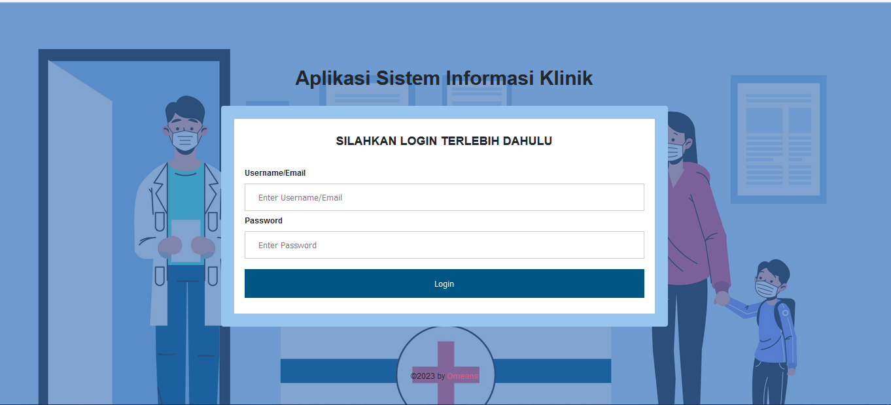
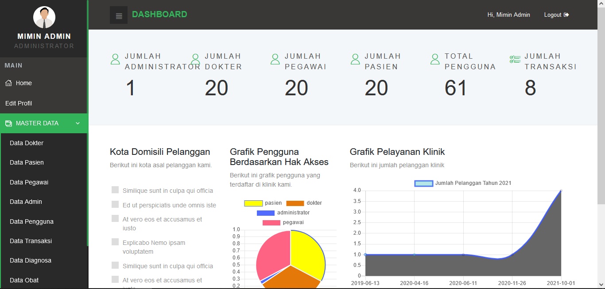

# Introduction

A comprehensive system information clinic application portfolio, designed to streamline clinic operations and improve patient care. This application provides a user-friendly interface for easy management of clinic information systems, with features such as role-based access control, system configuration, and more.

## Features

1. Patient Management

    * Patient data input
    * Patient data search and management
    * Patient visit history

2. Doctor Management

    * Doctor data input
    * Doctor data search and management
    * Doctor practice schedule

3. Medication Management

    * Medication data input
    * Medication data search and management
    * Medication stock management

4. Visit Management

    * Patient visit data input
    * Patient visit data search and management
    * Patient visit history

5. Medical Record Management

    * Patient medical record data input
    * Patient medical record data search and management
    * Patient medical record history

6. Reporting and Statistics

    * Patient visit reports
    * Medication stock reports
    * Patient visit statistics

7. Security and Access

    * Role-based access control (admin, doctor, nurse, etc.)
    * Data encryption for security

8. System Configuration

    * System application settings
    * Application parameter settings

and many more features that can help streamline clinic operations and improve patient care.

## Technologies Used

* PHP Native
 
## Screenshots

    </img> 
    </img>

## Getting Started

* [Install](https://www.apachefriends.org/download.html) xampp
* [Clone this repo](https://github.com/omeansteam/porto_aplikasi_sistem_informasi_klinik.git)
* Create database "aplikasi_sistem_informasi_klinik"
* [Import this file into database](https://github.com/omeansteam/porto_aplikasi_sistem_informasi_klinik/blob/main/assets/database/aplikasi_sistem_informasi_klinik.sql) "aplikasi_sistem_informasi_klinik"

## More Project
* [My Portfolio](https://github.com/topics/portfolio-aris-hadisopiyan)

## Contributing

If you're interested in contributing to Rental Mobil New, please see our [contributing guide](CONTRIBUTING.md).
## License

See the [LICENSE](https://github.com/omeansteam/porto_aplikasi_sistem_informasi_klinik/blob/main/LICENSE) file.
